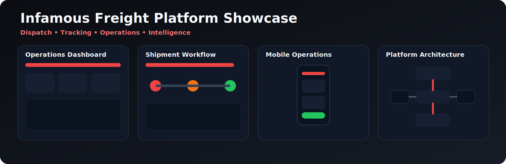
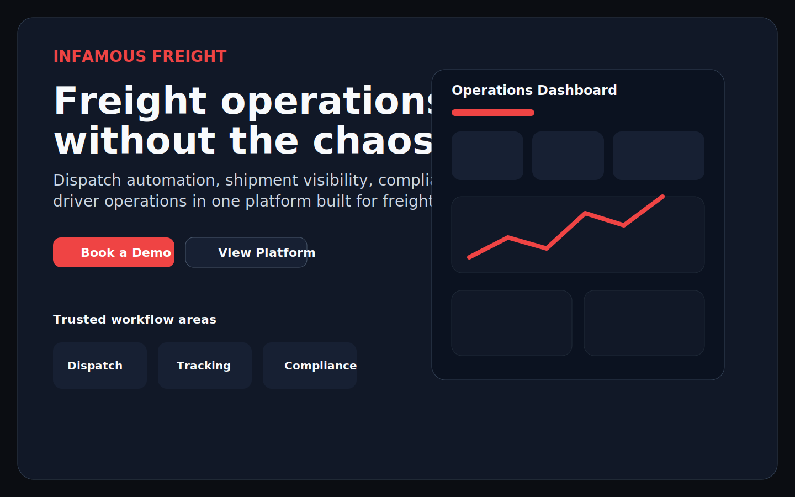
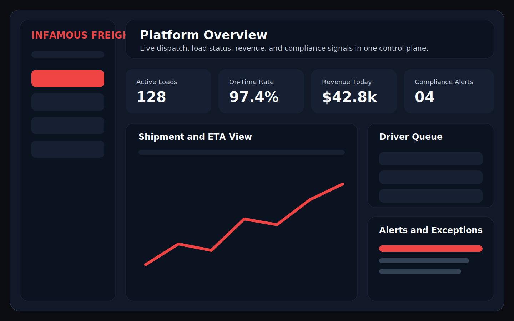

<p align="center">
  <a href="https://infamousfreight.com" target="_blank" rel="noopener noreferrer">
    
  </a>
</p>

# 🚛 Infamous Freight

> **The freight dispatch platform built by truckers, for truckers.**

Infamous Freight is an AI-powered freight operations platform for dispatch execution, shipment visibility, driver coordination, compliance workflows, and logistics automation.

Built as a monorepo, the platform combines an Express 4 backend, React web application, Prisma/PostgreSQL data workflows, real-time communications, billing flows, and operational tooling for modern freight teams.

If you want one system for dispatch, tracking, paperwork, and operations control, this is the platform.

---

## 🔗 Quick Links

- [Quick Start](#-quick-start)
- [Current Working Scope](#-current-working-scope)
- [Architecture Overview](#️-architecture-overview)
- [API Example](#-api-example)
- [Deployment](#-deployment)
- [Environment References](#-environment-references)
- [Docs by Goal](#-docs-by-goal)
- [Operations & Supply Chain Reference](#-operations--supply-chain-reference)
- [Launch Readiness](#-launch-readiness)
- [Production Operations](#-production-operations)
- [Contributing](#-contributing)

---

## 🔥 What It Does

Infamous Freight is designed to reduce manual dispatch work, improve load execution speed, increase margin per load, and centralize day-to-day freight operations in one system.

It brings together:

- 🚚 Dispatch automation
- 📍 Real-time tracking and ETA visibility
- 🤖 AI-assisted load matching and negotiation
- 💬 Driver-dispatch messaging
- 📄 Digital paperwork and invoicing
- 💵 Payroll and factoring workflows
- 🛡️ Compliance monitoring
- 📊 Rate analytics and broker intelligence

---

## 🎯 Why It Matters

Freight teams often operate across too many disconnected systems: calls, texts, spreadsheets, load boards, paperwork, compliance checklists, and delayed status updates.

Infamous Freight is built to reduce that operational drag by centralizing:

- dispatch execution
- shipment visibility
- driver coordination
- paperwork and invoicing
- compliance workflows
- operational reporting

---

## ⚙️ Core Features

- 🤖 **Auto-Dispatch AI** — Supports load-to-driver matching workflows and dispatch automation
- 💰 **Rate Negotiation Bot** — Supports negotiation workflows and margin protection
- 🎤 **Voice Booking** — Natural-language load search and booking workflows
- 🔌 **Multi-ELD Sync** — Samsara, Motive, Omnitracs, and Geotab integrations
- 🔎 **Load Board Aggregation** — Unified search across DAT, Truckstop, and 123Loadboard
- 📄 **Digital BOL / POD** — Upload, sign, and invoice in one workflow
- 🧾 **Driver Payroll** — Per-mile, percentage, flat-rate, or hourly settlement models
- 🏦 **Factoring Integration** — RTS, OTR, Apex, Bluevine, and eCapital support
- 🛡️ **CSA Score Monitor** — Supports CSA and compliance monitoring workflows
- 🏢 **Broker Credit Checks** — Ratings, payment history, and risk visibility
- 📡 **Geofencing & ETA** — Smart alerts and customer tracking links
- ⛽ **IFTA Auto-Reporting** — Quarterly fuel tax calculations
- 👥 **Team Management** — Role-based access for Owner, Dispatcher, Safety, Accountant, and Driver
- 📈 **Rate Analytics** — Historical trends and market comparisons
- 🧩 **Chrome Extension** — Book loads directly from load boards
- 💬 **Real-Time Chat** — Driver-dispatch messaging with voice notes
- 🔁 **Backhaul Finder** — Deadhead reduction workflows after delivery
- 📑 **Rate Confirmation Generator** — Professional PDF confirmations
- 🗂️ **Carrier Packet Generator** — W-9, COI, and insurance certificate workflows
- 💳 **Stripe Payments** — Subscription and pay-per-load billing
- 📚 **QuickBooks / Xero Sync** — Automated invoice sync

---

## 📌 Current Working Scope

### ✅ Working now

- health endpoints and API runtime
- tenant-aware API request handling
- role-based access guards
- load, driver, and shipment API surfaces
- Prisma-backed data access patterns
- Docker-based local startup
- CI/CD and deploy support docs
- environment bootstrap and validation scripts

### 🚧 In active build

- deeper dispatch decision automation
- richer shipment lifecycle workflows
- expanded analytics and reporting
- broader integrations and monitoring coverage
- production operations hardening

### 🗺️ Roadmap

- broader mobile operations support
- deeper AI orchestration
- expanded carrier network intelligence
- more complete automation around billing, notifications, and brokerage workflows

---

## 📸 Screenshots

<p align="center">
  
</p>

### 🖥️ Infamous Freight Landing Page


### 📊 Platform Overview


### 🖼️ Social Preview

The GitHub social preview image lives at [`docs/screenshots/infamousfreight-social-preview.png`](docs/screenshots/infamousfreight-social-preview.png) (1280×640 PNG, generated from `infamousfreight-header.svg`).

To regenerate after updating the header SVG:

```bash
npm run social-preview:generate
```

Maintainers must upload the resulting PNG via **Settings → General → Social preview** (GitHub does not accept SVG there and does not expose an API for this setting).

---

## ⚡ Quick Start

### 1️⃣ Install dependencies + bootstrap environment files

```bash
npm run env:setup
```

This installs workspace dependencies and creates local `.env` files from `*.env.example` for:

- repo root
- `apps/api`
- `apps/web`

Edit the generated `.env` files with the required API keys and environment values.

> Prisma commands run from the repo root, such as `npm run prisma:generate`, load environment values from the root `.env` file. API-local overrides such as `apps/api/.env` may also apply depending on how Prisma is invoked. If the same variable is defined in multiple places, verify which `DATABASE_URL` Prisma will use for that command.

### 2️⃣ Start with Docker (recommended)

```bash
docker-compose up -d
```

### 3️⃣ Or start manually

```bash
npm run db:setup
npm run dev
```

---

## 🧪 Development Workflow

### Recommended local flow

```bash
npm run env:setup
npm run db:setup
npm run dev
```

### Common commands

```bash
npm run env:setup
npm run db:setup
npm run dev
npm run build
npm run test
```

---

## 🧭 Operator Quick Reference

### Local setup

```bash
npm run env:setup
npm run db:setup
npm run dev
```

### Build and validate

```bash
npm run build
npm run test
npm run validate
```

### Deploy

```bash
flyctl deploy --app infamous-freight
```

### Verify

```bash
curl -X GET http://localhost:3000/api/health
curl -X GET https://infamousfreight.com/api/health
```

---

## 🔐 Environment References

For deployment-ready variable setup, use:

- [`docs/environment/ENVIRONMENT_VARIABLES_COMPLETE.md`](docs/environment/ENVIRONMENT_VARIABLES_COMPLETE.md) — full reference and verification
- [`docs/environment/CODEX_ENV_VARIABLES.txt`](docs/environment/CODEX_ENV_VARIABLES.txt) — quick copy/paste template
- [`docs/environment/README.md`](docs/environment/README.md) — usage notes

---

## 🧰 Git Remote Troubleshooting

If `git push` fails with:

```bash
fatal: No configured push destination.
```

Configure an upstream remote and branch:

```bash
git remote add origin <your-repo-url>
git push -u origin <your-branch>
```

You can verify remotes any time with:

```bash
git remote -v
```

---

## 🔍 Error Monitoring (Sentry)

`apps/web` is a Vite + React SPA. To set up or re-configure Sentry for it, run the React wizard:

```bash
cd apps/web
npx @sentry/wizard@latest -i react
```

> ⚠️ Do not use `-i nextjs` — `apps/web` is not a Next.js app.

### Sentry MCP server

For Sentry issue triage via MCP-compatible clients, configure the Sentry MCP endpoint with environment-based auth (never hardcode or commit tokens):

```json
{
  "mcpServers": {
    "sentry": {
      "url": "https://mcp.sentry.dev/mcp",
      "headers": {
        "Authorization": "Bearer ${SENTRY_ACCESS_TOKEN}"
      }
    }
  }
}
```

Use a short-lived token with the minimum scopes required for issue triage, store it in a local secret manager, and rotate immediately if exposed.

Example local setup (do not commit):

```bash
export SENTRY_ACCESS_TOKEN="<sentry-token>"
```

### Netlify sourcemap policy

Public requests for `*.map` files are blocked (`404`). Sourcemaps are still uploaded to Sentry during builds when `SENTRY_AUTH_TOKEN`, `SENTRY_ORG`, and `SENTRY_PROJECT` are configured.

### Optional Sentry environment variables

| Variable | Purpose | Required |
|---|---|---|
| `SENTRY_DSN` | Sentry DSN for the API runtime (`apps/api`) | No |
| `VITE_SENTRY_DSN` | Sentry DSN for the web app | No |
| `VITE_SENTRY_ENABLED` | Set to `false` to disable even when DSN is set | No |
| `SENTRY_AUTH_TOKEN` | CI secret for sourcemap upload | No |
| `SENTRY_ORG` | Sentry organization slug | No |
| `SENTRY_PROJECT` | Sentry project slug | No |
| `SENTRY_SOURCEMAPS` | Set to `1` to force sourcemap generation without upload | No |

> Sourcemaps are generated only when `SENTRY_AUTH_TOKEN` is present or `SENTRY_SOURCEMAPS=1` is set, so local and PR builds are not affected.

---

## 🏗️ Architecture Overview

```text
Web App (React + Vite)
        │
        ▼
API (Express 4 + TypeScript)
        │
        ├── Prisma ORM
        │      │
        │      ▼
        │  PostgreSQL
        │
        ├── Redis / caching workflows
        ├── Billing / Stripe
        ├── Notifications / messaging
        └── Analytics / operations logic
```

---

## 🔌 API Example

### Health check

```bash
curl -X GET http://localhost:3000/api/health
```

### Tenant-scoped loads request

```bash
curl -X GET http://localhost:3000/api/loads \
  -H "x-tenant-id: demo-tenant" \
  -H "x-user-role: dispatcher"
```

Expected request headers for protected operational routes:

- `x-tenant-id`
- `x-user-role`

---

## 🚀 Deployment

### GitHub Actions CI/CD

CI should use a single package-manager path end to end. This repository is currently documented and scripted around **npm workspaces**, and build, test, and deploy flows should stay aligned to that to avoid lockfile and install drift.

Add these secrets to your GitHub repository:

- 🔐 `FLY_API_TOKEN` — Fly.io deployment token
- 🔐 `VITE_API_URL` — Production API URL
- 🔐 `VITE_STRIPE_PUBLIC_KEY` — Stripe publishable key
- 🔐 `SENTRY_AUTH_TOKEN` — optional Sentry auth token for sourcemap upload
- ⚙️ `SENTRY_ORG` — optional Sentry org slug
- ⚙️ `SENTRY_PROJECT` — optional Sentry project slug

Push to `main` and the pipeline deploys:

- 🚚 API to Fly.io
- 🌐 Web to Netlify via Netlify’s native Git integration

### Manual deployment

#### API (Fly.io)

```bash
flyctl deploy --app infamous-freight
```

#### Web (Netlify)

Netlify auto-deploys from the `main` branch via its native Git integration. For manual deploys:

```bash
npm install -g netlify-cli
netlify deploy --prod --dir=apps/web/dist
```

### Deploy verification

After deployment, verify:

```bash
curl -X GET https://infamousfreight.com/api/health
```

Also confirm:

- API returns `200`
- database connectivity is healthy
- required env vars are present
- Fly app is listening on the expected internal port
- Netlify build points to the correct API URL

---

## 🛠️ Tech Stack

| Layer | Technology |
|---|---|
| 🎨 Frontend | React 18, TypeScript, Vite, Tailwind CSS, Zustand, Socket.io |
| 🧠 Backend | Express 4, TypeScript, Prisma ORM |
| 🗄️ Database | PostgreSQL 16 |
| ⚡ Cache | Redis 7 |
| 📡 Realtime | Socket.io WebSockets |
| 💳 Payments | Stripe |
| 🔐 Auth | Supabase Auth + JWT |
| ☁️ Deployment | Fly.io (API), Netlify (Web), Docker |

---

## 🗂️ Project Structure

```text
apps/
├── api/                    # Express 4 backend
│   └── src/
│       ├── app.ts          # Express app factory (routes, middleware)
│       ├── server.ts       # Entry point — starts the HTTP server
│       ├── data-store.ts   # Data access layer (Prisma)
│       ├── billing.ts      # Stripe billing helpers
│       ├── dispatch/       # Auto-dispatch AI, backhaul, rate negotiation
│       ├── loads/          # Load board aggregation
│       ├── invoice/        # BOL/POD + invoicing
│       ├── eld/            # ELD integrations
│       ├── chat/           # Real-time messaging
│       ├── payroll/        # Driver settlements
│       ├── factoring/      # Factoring integrations
│       ├── compliance-csa/ # CSA/SMS monitoring
│       ├── compliance-expiry/
│       ├── accounting/
│       ├── rate-analytics/
│       ├── broker-credit/
│       ├── geofencing/
│       ├── ifta/
│       ├── rbac/
│       ├── redis/
│       ├── rate-limit/
│       ├── stripe/
│       ├── uploads/
│       ├── notifications/
│       └── audit/
│
└── web/                    # React frontend
    └── src/
        ├── pages/          # Dashboard, Loads, Dispatch, Drivers
        ├── components/     # UI and feature components
        ├── layouts/        # App shell and sidebar
        ├── store/          # Zustand state management
        ├── api-client/     # Axios API wrapper
        └── extension/      # Chrome extension

compliance/                 # Canadian HOS rules
templates/                  # Cold emails + LinkedIn calendar
docs/                       # Sales playbook, launch checklists
scripts/                    # Setup, validation, and deployment helpers
Dockerfile.api
docker-compose.yml
nginx.conf
.github/workflows/          # CI/CD pipeline
```

---

## 📚 Docs by Goal

### New here
- [Quick Start](#-quick-start)
- [Development Workflow](#-development-workflow)
- [Environment References](#-environment-references)

### Understand the system
- [Architecture Overview](#️-architecture-overview)
- [`docs/ARCHITECTURE.md`](docs/ARCHITECTURE.md)
- [`docs/API-REFERENCE.md`](docs/API-REFERENCE.md)

### Deploy and operate
- [Deployment](#-deployment)
- [`docs/INTEGRATIONS-AND-SECRETS.md`](docs/INTEGRATIONS-AND-SECRETS.md)
- [`docs/NETLIFY-BUILDHOOKS.md`](docs/NETLIFY-BUILDHOOKS.md)
- [`docs/REQUIRED-CLIS.md`](docs/REQUIRED-CLIS.md)
- [`docs/SBOM-POLICY.md`](docs/SBOM-POLICY.md)

### Launch readiness
- [Launch Readiness](#-launch-readiness)
- [`docs/PRODUCTION_READINESS_VERIFICATION.md`](docs/PRODUCTION_READINESS_VERIFICATION.md)
- [`docs/ROLLBACK_PLAN.md`](docs/ROLLBACK_PLAN.md)

### Freight operations
- [Production Operations](#-production-operations)
- [`docs/production-operations/OPERATING_MODEL.md`](docs/production-operations/OPERATING_MODEL.md)
- [`docs/production-operations/DISPATCH_WORKFLOW.md`](docs/production-operations/DISPATCH_WORKFLOW.md)
- [`docs/production-operations/DAILY_OPERATIONS_SOP.md`](docs/production-operations/DAILY_OPERATIONS_SOP.md)

---

## 🧩 Platform Areas

### 🚚 Dispatch Operations
Load assignment, driver coordination, backhaul workflows, negotiation automation, and load execution.

### 📡 Tracking & Visibility
Location visibility, smart alerts, ETA workflows, and customer-facing tracking updates.

### 💬 Communication
Real-time dispatch-driver messaging, voice notes, and operational notifications.

### 💵 Financial Workflows
Driver payroll, factoring support, invoice generation, and accounting integrations.

### 🛡️ Compliance & Safety
CSA monitoring, document expiry management, fuel tax reporting, and operational compliance support.

### 📊 Intelligence & Analytics
Broker scoring, market rate analysis, historical pricing, and load decision support.

---

## 📌 Current Status

### ✅ Implemented Areas

- 🧠 AI dispatch and negotiation workflows
- 🔎 Load aggregation and booking support
- 💬 Real-time chat and operational messaging
- 🧾 Document upload, BOL/POD, and invoicing flows
- 💳 Payment and subscription infrastructure
- 📊 Broker, rate, and operations analytics
- 🔐 Role-based access and audit support
- 🛡️ Compliance and tracking services
- 🔁 CI/CD pipeline and deployment automation

### 🚧 Expansion Areas

- 📱 Deeper mobile operations support
- 🤖 Expanded AI orchestration and workflow automation
- 🌍 Broader carrier network intelligence
- 📈 Improved analytics and operational reporting
- 🔗 Expanded third-party integration coverage

---

## 🧭 Why It Exists

Freight operations still run on too many disconnected tools, manual phone calls, spreadsheets, load board tabs, and delayed status updates.

Infamous Freight is built to centralize dispatch, tracking, compliance, communication, paperwork, and financial workflows into a single operating system that reflects how freight teams actually work.

---

## 📚 Operations & Supply Chain Reference

For operational ownership, deployment runbooks, integration provenance, and SBOM review standards, use these docs:

- [`docs/ARCHITECTURE.md`](docs/ARCHITECTURE.md) — canonical backend architecture, framework, ports, entry points, and migration notes
- [`docs/API-REFERENCE.md`](docs/API-REFERENCE.md) — complete list of implemented API routes with request headers and response shapes
- [`docs/INTEGRATIONS-AND-SECRETS.md`](docs/INTEGRATIONS-AND-SECRETS.md) — external integrations, secret ownership, deploy failure runbooks, and rotation guidance
- [`docs/NETLIFY-BUILDHOOKS.md`](docs/NETLIFY-BUILDHOOKS.md) — provenance, integrity, and maintenance guidance for Netlify URL-hosted buildhook packages
- [`docs/REQUIRED-CLIS.md`](docs/REQUIRED-CLIS.md) — required local CLI installation, PATH setup, and verification
- [`docs/SBOM-POLICY.md`](docs/SBOM-POLICY.md) — runtime-vs-build SBOM policy, review cadence, classification rules, and triage standards

---

## ✅ Launch Readiness

Production launch approval is evidence-based. Use these documents before private beta, paid beta, or public launch:

- [`docs/LAUNCH_READINESS_INDEX.md`](docs/LAUNCH_READINESS_INDEX.md) — entry point for launch readiness, launch gates, and execution order
- [`docs/PRODUCTION_READINESS_VERIFICATION.md`](docs/PRODUCTION_READINESS_VERIFICATION.md) — main readiness checklist and launch decision gate
- [`docs/LAUNCH_EVIDENCE_LOG.md`](docs/LAUNCH_EVIDENCE_LOG.md) — required evidence log for test output, owners, blockers, and final decision
- [`docs/ROLLBACK_PLAN.md`](docs/ROLLBACK_PLAN.md) — rollback triggers and recovery process
- [`docs/PRODUCTION_TEST_DATA_PLAN.md`](docs/PRODUCTION_TEST_DATA_PLAN.md) — controlled production test data and cleanup rules
- [`docs/STRIPE_WEBHOOK_VERIFICATION.md`](docs/STRIPE_WEBHOOK_VERIFICATION.md) — Stripe webhook, billing, idempotency, refund, and failure checks
- [`docs/ADMIN_RECOVERY_RUNBOOK.md`](docs/ADMIN_RECOVERY_RUNBOOK.md) — admin recovery procedures for support and operations
- [`docs/BACKUP_RESTORE_VERIFICATION.md`](docs/BACKUP_RESTORE_VERIFICATION.md) — backup and restore proof process
- [`docs/NOTIFICATION_DELIVERABILITY_VERIFICATION.md`](docs/NOTIFICATION_DELIVERABILITY_VERIFICATION.md) — email, SMS, in-app, and support inbox delivery checks
- [`docs/LAUNCH_BLOCKER_TEMPLATE.md`](docs/LAUNCH_BLOCKER_TEMPLATE.md) — blocker format for failed or unknown launch checks

---

## 📦 Production Operations

For operating model, compliance, carrier vetting, dispatch, daily operations, sales, and launch execution, use these docs:

- [`docs/production-operations/README.md`](docs/production-operations/README.md) — production operations package index
- [`docs/production-operations/OPERATING_MODEL.md`](docs/production-operations/OPERATING_MODEL.md) — brokerage and logistics operating model
- [`docs/production-operations/LAUNCH_CHECKLIST.md`](docs/production-operations/LAUNCH_CHECKLIST.md) — launch execution checklist
- [`docs/production-operations/COMPLIANCE_CHECKLIST.md`](docs/production-operations/COMPLIANCE_CHECKLIST.md) — freight brokerage compliance checklist
- [`docs/production-operations/CARRIER_VETTING_SOP.md`](docs/production-operations/CARRIER_VETTING_SOP.md) — carrier qualification workflow
- [`docs/production-operations/DISPATCH_WORKFLOW.md`](docs/production-operations/DISPATCH_WORKFLOW.md) — shipment dispatch workflow
- [`docs/production-operations/DAILY_OPERATIONS_SOP.md`](docs/production-operations/DAILY_OPERATIONS_SOP.md) — daily operating cadence
- [`docs/production-operations/SHIPPER_SALES_SCRIPT.md`](docs/production-operations/SHIPPER_SALES_SCRIPT.md) — shipper outreach script
- [`docs/production-operations/GITHUB_EXECUTION_BACKLOG.md`](docs/production-operations/GITHUB_EXECUTION_BACKLOG.md) — repo execution backlog

---

## 🔒 Security

Security expectations include:

- 🚫 Never commit secrets
- ✅ Validate all external inputs
- 🔐 Protect auth and token flows
- 🧱 Maintain role-based access boundaries
- 📜 Log important operational and audit events

---

## 🤝 Contributing

See `CONTRIBUTING.md`.

### ✅ Pull Request Checklist

Before submitting a PR:

- ✅ Build passes
- ✅ Tests pass
- ✅ Environment changes are documented
- ✅ Screenshots or logs are included when relevant

### 🌿 Branch Naming Examples

- `feature/dispatch-engine`
- `feature/rate-negotiation-bot`
- `feature/load-aggregation`
- `fix/api-timeout`
- `docs/readme-update`

### 📝 Commit Format

This repository follows Conventional Commits.

Examples:

- `feat: add broker credit scoring module`
- `fix: resolve websocket reconnect issue`
- `docs: update deployment instructions`

---

## 🌐 Live Project

- Website: [infamousfreight.com](https://infamousfreight.com)
- GitHub Pages Preview: [infamous-freight.github.io/Infamous-freight](https://infamous-freight.github.io/Infamous-freight/)
- Repository: [github.com/Infamous-Freight/Infamous-freight](https://github.com/Infamous-Freight/Infamous-freight)

---

## 📄 License

Copyright 2025 Infamous Freight. All rights reserved.

---

## Operations Shortcuts

Use these root-level scripts for consistent local and CI operations:

- `pnpm run setup:deps-docker` — install workspace dependencies, run Prisma client generation, and validate Docker CLI availability
- `pnpm run setup:clis` — install required deployment CLIs (`flyctl`, `supabase`, `stripe`) into `.tools/bin`
- `pnpm run tools:install` — alias for `pnpm run setup:clis`
- `pnpm run tools:verify` — verify required deployment CLIs are available globally or in `.tools/bin`
- `pnpm run smoke:api:health` — boot the compiled API on `PORT` (default `3000`) and verify `/health`
- `pnpm run snapshot:prod` — run production-readiness snapshot checks (Prisma generate, build, tests, smoke health, optional Docker build)

For PATH setup and CLI troubleshooting, see [`docs/REQUIRED-CLIS.md`](docs/REQUIRED-CLIS.md).
