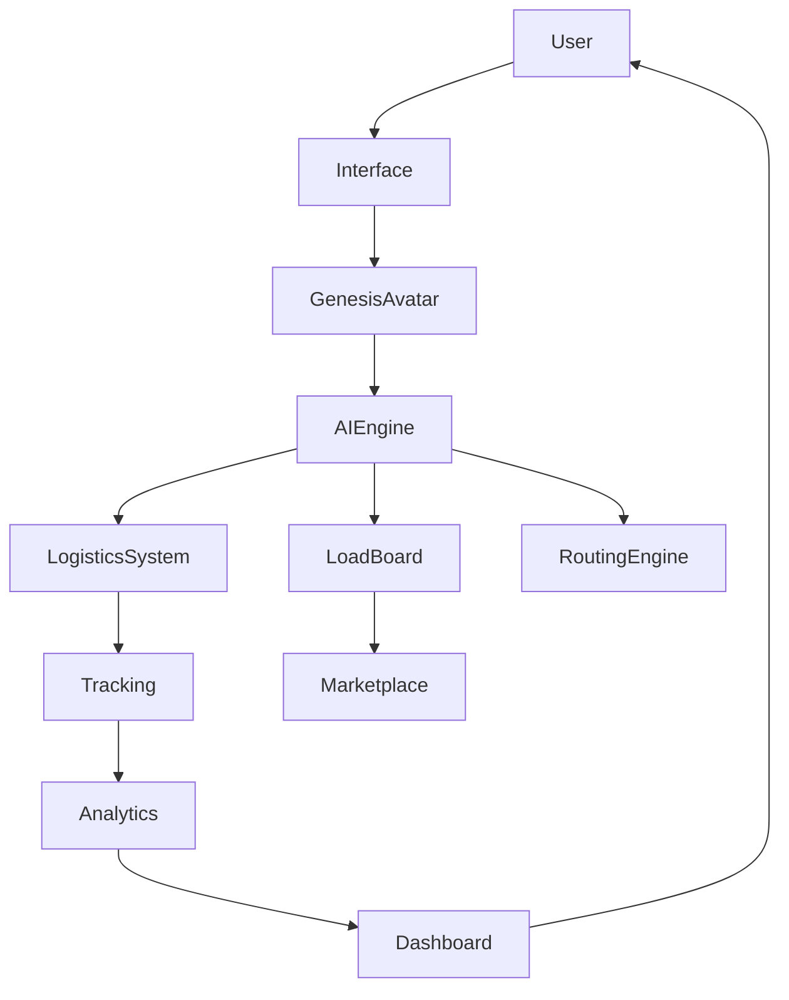
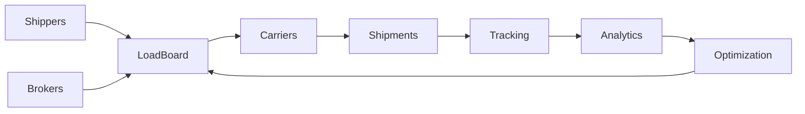

# Infæmous Freight — Full Platform Execution Blueprint

## 1) Core Platform Architecture

The platform is organized as five integrated layers:

| Layer              | Function                             |
| ------------------ | ------------------------------------ |
| Interface Layer    | Mobile app and web dashboard         |
| AI Layer           | Genesis Avatar + AI command engine   |
| Logistics Layer    | Shipments, routing, tracking         |
| Marketplace Layer  | Load board + carrier/broker network  |
| Intelligence Layer | Analytics, forecasting, optimization |



---

## 2) Mobile App Structure

The mobile experience is optimized for drivers, operators, and dispatchers.

### Navigation

- Home
- Load Board
- Shipments
- Routes
- Alerts
- Profile

### Home Dashboard

- Genesis avatar assistant
- Active shipments
- Quick load board access
- Alerts
- Quick commands

Example interaction:

1. User taps avatar.
2. User asks: “Find profitable loads near Dallas.”
3. AI returns ranked load suggestions.

---

## 3) Website Dashboard

Desktop operations require broader visibility and controls.

### Sidebar

- Dashboard
- Load Board
- Shipments
- Routes
- Analytics
- Notifications
- Support

### Core widgets

- Active shipments
- Available loads
- Optimized routes
- Revenue metrics

Center panel: live tracking map with truck positions and routes.

---

## 4) Load Board System (Core Marketplace)

The load board is the marketplace and primary transaction hub.

### Core workflow

- Shippers and brokers post loads.
- Carriers review and claim loads.

### Required load fields

- Load ID
- Origin
- Destination
- Distance
- Weight
- Rate
- Pickup window
- Delivery window

### Example load

- **Dallas → Denver**
- **22,000 lb**
- **$4,200**

Primary action: **Claim Load**.

---

## 5) AI Load Matching

The AI engine recommends loads based on:

- Driver location
- Route efficiency
- Fuel cost
- Deadhead distance
- Load profitability

Primary objective: minimize empty miles while maximizing net margin.

---

## 6) Carrier Network

Carriers onboard by creating company and fleet profiles.

### Carrier profile fields

- Company name
- MC / DOT number
- Equipment type
- Trailer type
- Capacity

### Carrier dashboard

- Active loads
- Load history
- Route suggestions
- Revenue metrics

---

## 7) Broker Network

Broker features:

- Post loads
- Set rates
- Choose carriers
- Monitor shipments

The system also supports AI-assisted carrier auto-match.

---

## 8) Shipper Portal

Shipper tools:

- Create shipment
- Track shipments
- Analytics
- Invoices

Shippers can monitor delivery performance and cost outcomes.

---

## 9) Shipment Management System

Shipment lifecycle states:

1. Created
2. Assigned
3. Picked up
4. In transit
5. Delivered

Status updates feed tracking, alerts, and analytics services.

---

## 10) Routing Optimization Engine

Route recommendations are generated with:

- Distance
- Traffic
- Weather
- Fuel stops

Operators retain manual override for constrained or priority moves.

---

## 11) Real-Time Tracking

GPS integrations provide live visibility for:

- Truck position
- Route progress
- Estimated arrival time (ETA)

Tracking events are connected to both alerting and analytics pipelines.

---

## 12) Notification System

Event-driven notifications include:

- Load assigned
- Route delay
- Weather warning
- Delivery completed

Delivery channels:

- In-app dashboard alerts
- Mobile push notifications
- Genesis avatar visual state changes

---

## 13) Analytics Engine

Key operational metrics:

- Average delivery time
- Fuel efficiency
- Load profitability
- Driver performance
- Route efficiency

Analytics outputs are available via dashboards and exportable reports.

---

## 14) Revenue Engine

### Platform fees

- Load posting fees
- Transaction commissions
- Subscription plans

### Premium monetization

- AI optimization suite
- Advanced analytics
- Priority load placement

---

## 15) Multi-Tenant SaaS Architecture

Supports isolated tenants sharing platform infrastructure.

### Tenant types

- Carriers
- Brokers
- Shippers

Administrative controls manage org-level policies, access, and configuration.

---

## 16) Repository Structure

```text
/apps
   /api
   /web
   /mobile
   /worker

/packages
   /shared
```

---

## 17) Genesis Avatar System

The Genesis Avatar is the conversational orchestration layer for user actions.

### Avatar states

- Idle
- Suggesting loads
- Alert
- Critical

Example command:

- User: “Optimize my route.”
- System: evaluates route candidates and returns the best option with rationale.

---

## 18) Future Expansion

Planned capabilities:

- AI autodispatch (automatic load assignment)
- Freight demand prediction by region
- National carrier network growth
- Smart rate prediction and pricing guidance

---

## 19) Platform Vision



The long-term target is a self-improving freight intelligence network where
operational outcomes continuously refine matching, routing, and pricing.
