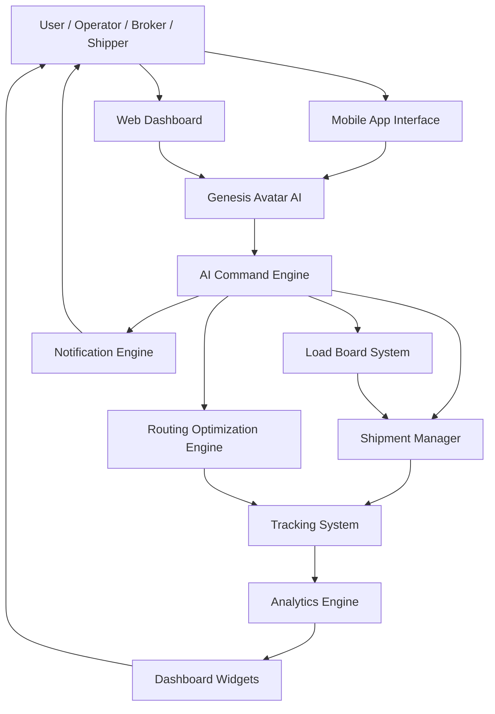

# System Architecture

Infæmous Freight Enterprise is a multi-tenant AI-first logistics operating
system.

Core layers:

- API (Express + Prisma)
- AI Synthetic Intelligence ♊️ orchestration
- Web dashboard (Next.js)
- Mobile application (React Native)
- Shared domain packages

AI agents are first-class system actors, with the UI remaining as a thin,
stateless shell. All intelligence, validation, and state transitions run
server-side for observability, auditability, and resilience.

## Layered Architecture

Client (Web / Mobile) → API Gateway → AI Orchestration → Business Logic Engine →
Data + Memory Layer → Automation + Jobs

## Implementation Path Map (Authoritative)

Use the following repository paths as the execution reference for current
implementation ownership:

- **UI implementation:** `apps/web/`
- **AI implementation:** `apps/ai/`
- **Financial/billing implementation:** `apps/api/src/routes/billing.js`,
  `apps/api/src/services/`, and `payments/`
- **Shared contracts/types/utilities:** `packages/shared/`

> Note: legacy references to `packages/ui`, `packages/ai-engine`, and
> `packages/financial` are obsolete in this repository and should not be used
> for implementation work.

## Architecture Freeze Policy

To stop structural churn, the architecture is frozen and changes to core
boundaries require an ADR and approval. See
[ADR-0007: Architecture Freeze and Change Control](adr/0007-architecture-freeze.md)
for the decision, scope, and allowed changes.

### Core Responsibilities

- **API Gateway**: Authentication, rate limiting, request normalization, and
  routing to orchestrated skills.
- **AI Orchestration Layer**: Prompt router, skill selection, memory injection,
  model routing, validation, and fallback reasoning.
- **Business Logic Engine**: Domain services for billing, invoice intelligence,
  ERP/TMS integrations, compliance, and workflow state machines.
- **Data + Memory Layer**: PostgreSQL with JSONB for embeddings, optional vector
  index, Redis for cache/session, and durable audit/event streams.
- **Automation + Jobs**: BullMQ/Temporal-backed schedulers for learning loops,
  monitoring, alerts, and auto-optimization tasks.

## Frontend (Web + Mobile)

- **Stack**: Next.js 14, TypeScript, TailwindCSS, server actions, auth
  middleware; React Native for mobile.
- **Modules**: Dashboard, AI avatar interface, task/workflow viewer, billing,
  settings, memory/history view.
- **Principles**: Stateless UI, realtime updates via WebSockets, avatar as
  presentation only (no client-side logic), feature flags for rollout.

## AI Synthetic Intelligence Layer

- **Components**: Prompt router, skill modules, memory engine, decision scorer,
  fallback reasoner.
- **Flow**: User intent → classifier → skill match → memory injection → LLM
  execution (OpenAI primary, Anthropic secondary, heuristic fallback) →
  validation → action/response.
- **Safety**: Deterministic validation, tool-use approvals, audit trails per
  decision, and consistent persona (“persistent AI operator”).

## Avatar System

- **State**: Avatar profile + personality matrix + visual state engine +
  interaction history.
- **Capabilities**: Learns user behavior, adapts tone, surfaces proactive
  recommendations, represents AI as a human-like operator backed by memory.

## Memory Engine

- **Types**: Short-term (session), long-term (user), task memory, preference
  memory.
- **Storage**: PostgreSQL (structured), JSONB for embeddings, optional vector
  index, Redis for fast session/cache.
- **Rules**: Always retrieve before responding, avoid hallucination, decay
  unused memory, promote frequently used memory, include retrieval traces in
  audit logs.

## Backend API

- **Stack**: Node.js 20, Express/Fastify, Prisma ORM, PostgreSQL, Redis.
- **Services**: Auth, AI execution, avatar state, billing, automation, webhooks,
  ERP/TMS connectors, invoice intelligence.
- **Security**: JWT + refresh, rate limiting, encrypted secrets, audit logs,
  SOC2-lite controls.

## Automation Engine

- **Jobs**: Scheduled AI tasks, monitoring, alerts, auto-optimizations, daily
  system learning, data hygiene.
- **Tools**: BullMQ/Temporal with cron fallbacks and idempotent job handlers.

## Billing & Access Control

- **Billing**: Stripe subscriptions + usage metering, AI-call metering,
  plan-based entitlements.
- **Access**: RBAC with scopes, feature flags per role/plan, webhook signing for
  external callbacks.

## Deployment & CI/CD

- **Infrastructure**: Docker for all services; Render/Fly.io for API, Vercel for
  frontend; Supabase/RDS for PostgreSQL.
- **Pipelines**: GitHub Actions with lint/type-check/test gates, build
  artifacts, deployment promotion with rollbacks, environment secrets via secure
  stores.
- **Observability**: Structured logging, request IDs, distributed tracing, SLO
  dashboards, alerting hooks into monitoring tools.

## Complete Platform Blueprint (Genesis-Centered)

The platform interaction model is centered on the Genesis Avatar as the single
command and feedback interface for operators, brokers, and shippers.



### Interaction Principle

Users do not interact directly with backend modules. The canonical flow is:

**Avatar → AI Engine → Logistics Modules → Data/Insights → User Actions**

This preserves a consistent, intelligent operator experience while keeping
orchestration and decisioning centralized.

### Mobile App Layout

Bottom navigation:

- Home
- Load Board
- Shipments
- Routes
- Alerts
- Profile

Home dashboard composition:

- Genesis Avatar panel
- Active shipments list
- Quick actions (Create Shipment, View Load Board, Optimize Routes)
- Alerts stream

The Avatar remains available as a persistent floating action element for AI
command entry.

### Load Board (Easy Access)

The load board is treated as a real-time marketplace and exposed as a primary
navigation destination across mobile and web.

Core elements:

- Search and filters (location, distance, weight, equipment/type)
- Available load cards with lane, weight, and rate
- One-tap claim action
- AI recommendation strip (“Best load for your route today”)

AI load matching factors:

- Driver location
- Fuel cost context
- Route efficiency
- Load profitability
- Deadhead distance

### Web Dashboard Layout

Desktop dashboard composition:

- Left sidebar: Dashboard, Load Board, Shipments, Routes, Analytics,
  Notifications, Support
- Main panel: map + active shipments, shipment cards, alerts panel, and KPI
  widgets

Recommended KPI widgets:

- Active Shipments
- Available Loads
- Routes Optimized Today
- Revenue Today

### Genesis Avatar Behavioral States

| State      | Meaning                                     |
| ---------- | ------------------------------------------- |
| Idle       | Waiting for commands                        |
| Suggesting | Recommending loads/actions                  |
| Alert      | Shipment issue requires attention           |
| Critical   | Delay/route issue requires immediate action |

### Analytics Engine Focus

Operational intelligence should prioritize:

- Average delivery time
- Fuel efficiency
- Load profitability
- Driver performance
- Route efficiency

### Production-Oriented Repo Shape (Target)

```text
/apps
   /mobile
   /web

/packages
   /ai
   /logistics
   /loadboard
   /tracking
   /notifications

/components
   Avatar
   Dashboard
   ShipmentCard
   RouteMap
   LoadBoardCard

/modules
   aiEngine
   shipmentManager
   loadBoardManager
   routingEngine
   analyticsEngine

/assets
   avatars
   icons
```

### Ecosystem Flywheel

1. Shippers post loads.
2. Loads surface in the Load Board.
3. Carriers claim loads.
4. AI optimizes routes and assignment.
5. Tracking and analytics improve execution.
6. Better outcomes compound into revenue and efficiency.

### Strategic Expansion Opportunities

- AI autodispatch
- Smart rate prediction
- National carrier network enrollment
- Broker marketplace onboarding
- Predictive freight intelligence for congestion and delay risk
